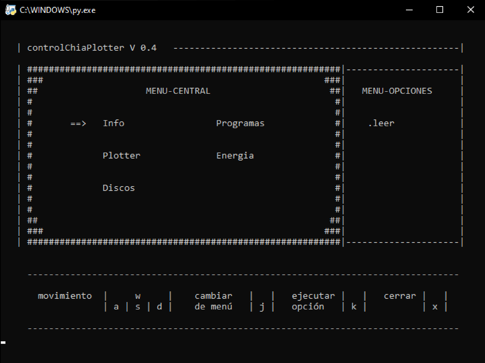

# plotteradmin (version para windows)
Generador seteable de plotts automáticos para chia-blockchine programado en Python, el mismo esta basado en la aplicación <a href="https://github.com/madMAx43v3r/chia-plotter">chia-plotter</a> del usuario <a href="https://github.com/madMAx43v3r/">madMAx43v3</a>. El programa funciona en su compilación para Windows generada por <a href="https://github.com/stotiks/chia-plotter/releases">stotiks</a>

